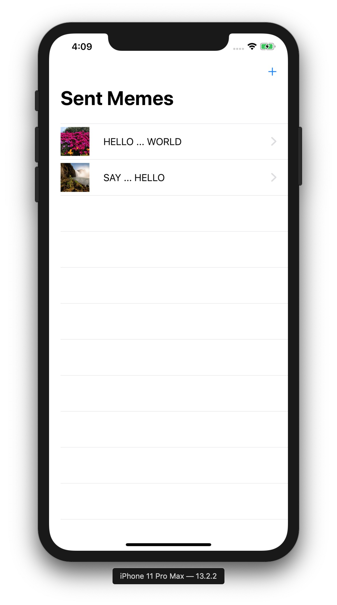

# MemeMe

**MemeMe** is a meme-generating app that enables a user to attach a caption to a picture from their phone. After adding text to an image chosen from the Photo Album or Camera, the user can share it with friends. **MemeMe** also temporarily stores sent memes which users can browse in a table or a grid.

This project is part of the [Udacity iOS Developer Nanodegree](https://www.udacity.com/course/ios-developer-nanodegree--nd003).

## Screenshots

    
    

## License

The content of this repository is licensed under a [MIT License](LICENSE).
